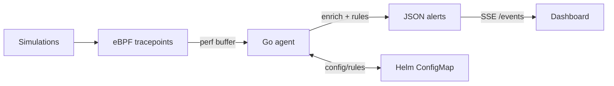

# Architecture Overview

## Components
- **eBPF probe** (`ebpf/process_monitor.c`): tracepoints on `execve`, `connect`, `ptrace`, `memfd_create`, and `mmap` (PROT_EXEC). Emits minimal metadata via perf buffer.
- **Agent** (`agent/`): Go service that loads the BPF object, consumes perf events, enriches with container/pod metadata, and applies rule engine.
- **Rules engine** (`agent/rules.go`): evaluates reverse shell, injection primitives, and suspicious exec heuristics. Produces JSON alerts with risk scores and recommendations.
- **Dashboard** (`dashboard/`): React/Vite single-page app consuming WebSocket events (expected at `ws://<host>:8090/events`) for live visuals.
- **Deployment** (`deploy/helm/`): Helm chart with DaemonSet (agent), Deployment/Service (dashboard), ConfigMap (rules), and RBAC.
- **Simulations** (`scripts/`): local, safe scripts to trigger detections.

## Data flow

## Clean architecture notes
- BPF layer limited to collection; policy lives in user space.
- Rules separated into pure functions for testability.
- Enrichment functions abstract container/pod lookup.
- UI is presentation-only; it assumes an event feed adapter.

## Security boundaries
- No kernel modifications; read-only eBPF tracepoints.
- Minimal data retention; no payloads captured.
- RBAC minimal for pod/node metadata.
